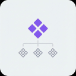

<h1 align="center">Figma Components Manager</h1>

    
     
    A Figma plugin to manage and navigate your Components, Variants and Instances.
     
     
    <strong>
    <a href="https://www.figma.com/community/plugin/1382732229316572990/components-manager">Get it on Figma Community</a>
    </strong>
     
     
    

## Features

- List all Components in the document
- List the corresponding Variants in the document
- Quickly navigate to a Component or Variant by clicking in the list
- Show amount of instances of a Component or Variant in the document
- Automatic refresh when the document changes (optional, can be toggled off for performance)
- List all Instances of a Component or Variant in the document
- Search through all Components, Variants and Instances
- Resize Plugin window to your liking
 

### Requested, not implemented (Pull Requests welcome)

- Group Components by Page
- Show all instances for which the component was deleted
- (X) button to clear search input
- Jump from Components tab to the corresponding instances for a selected component/variant
- Fix some minor light mode styling issues (everything is readable, but could be prettier)

## Technical Documentation

### Overview

This plugin uses Typescript and the <a href="https://developer.mozilla.org/en-US/docs/Web/API/Web_components">Web Components</a> standard for the frontend UI.

Figma plugins run in two layers:

**Sandbox/backend**

The main code that interacts with the Figma document. It has access to the Scene with all nodes and can modify them.
The corresponding code is in the `/backend` directory.

**UI/frontend**

The user interface window for the plugin, runs in an iframe inside the figma editor. 
It can send and receive messages to/from the backend, to display received data or trigger manipulations in the document.
The corresponding code is in the `/frontend` directory.

This plugin additionally has a `/shared` directory, which contains files that are shared between the backend and frontend, such as types and utility functions.

For more information on Figma plugin development see the <a href="https://developers.figma.com/docs/plugins/how-plugins-run/">Official Figma Plugin Documentation</a>.

### Development

Webpack is used as build tool for creating:

- `build/backend-bundle.js`: a single bundled javascript file for the backend
- `build/ui.html`: a single html file for the frontend UI, with inlined javascript and css

To start developing:

- Open Figma desktop
- Open project and go to `Menu -> Plugins -> Development -> Import Plugin from Manifest...`
  - Also enable `Menu -> Plugins -> Development -> Hot Reload Plugins` for automatic reload on new builds
- Use `npm run watch` to start the development build, which will rebuild on file changes